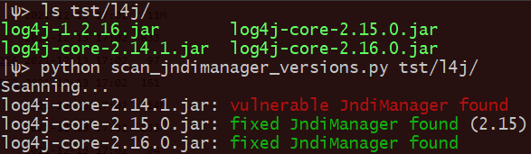
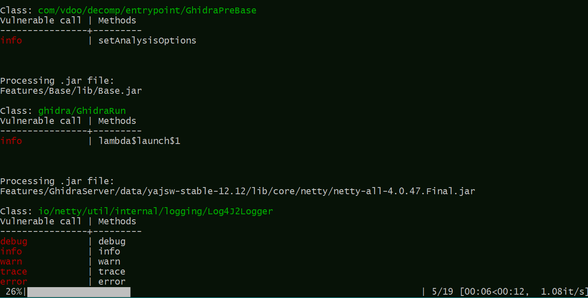

# log4j-tools

### Quick links

Click to find:

| [Inclusions of `log4j2` in compiled code](#scan_jndimanager_versionspy) | [Calls to `log4j2` in compiled code](#scan_log4j_calls_jarpy) | [Calls to `log4j2` in source code](#scan_log4j_calls_srcpy) |
| ------------------------------------------------------------ | ------------------------------------------------------------ | ----------------------------------------------------------- |
| [Sanity check for env mitigations](#env_verifyjar)           | [Applicability of CVE-2021-45046](#scan_cve_2021_45046_config) | [Xray wrapper for Log4Shell](#log4shell_xray_wrapper)       |
| [Automatically patch container images in Artifactory](patch_rt_container_registry_repos/python/README.md) |                                                              |                                                             |

### Overview

CVE-2021-44228 poses a serious threat to a wide range of Java-based applications. The important questions a developer may ask in this context are:

### 1. Does my code include `log4j2`?

Does the released code include `log4j2`? Which version of the library is included there? Answering these questions may not be immediate due to two factors:

1) Transitive dependencies: while `log4j2` may not be in the direct dependency list of the project, it may be used indirectly by some other dependency.

2) The code of this library may not appear directly as a separate file (i.e., `log4j2-core-2.xx.0.jar`), but rather be bundled in some other code jar file.

JFrog is releasing a tool to help resolve this problem: [`scan_log4j_versions`](#scan_log4j_versionspy). The tool looks for the **class code** of `JndiManager`  and `JndiLookup` classes **(regardless of containing `.jar` file names and content of `pom.xml` files)**, and attempts to fingerprint the versions of the objects to report whether the included version of `log4j2` is vulnerable. Both Python and Java implementations are included.

### 2. Where does my code use `log4j2`? 

The question is relevant for the cases where the developer would like to verify if the calls to log4j2 in the codebase may pass potentially attacker-controlled data. While the safest way to fix the vulnerability, as discussed in the advisories, is to apply the appropriate patches and global flags, controlling for and verifying the potential impact under assumption of unpatched `log4j2` may be valuable in many situations. In order to address this problem JFrog is releasing two scripts:

1. [`scan_log4j2_calls_src.py`](#scan_log4j_calls_srcpy), which locates calls to log4j2 logging functions (info, log, error etc.) with non-constant arguments in *.java source files* and reports the findings on the level of source file and line
2. [`scan_log4j2_calls_jar.py`](#scan_log4j_calls_jarpy), which locates the calls to logging functions in *compiled .jar*s, and reports the findings as class name and method names in which each call appears.

### 3. Am I configuring this correctly?

Due to the high risk associated with the vulnerability, developers relying on mitigations may want to double check that the environment was indeed configured correctly (which Java runtime actually runs the application? Were environment and command line flags set correctly?). In order to simplify this sanity check, JFrog is releasing a few tools. The tools are intended to run in the same environment as a production application.

* [env_verify.jar](#env_verifyjar) will validate the proper application of mitigations against CVE-2021-44228.
* [scan_cve_2021_45046_config](#scan_cve_2021_45046_config) will validate the `log4j2` configuration does not allow for exploitation of CVE-2021-45046.

------

## Usage instructions

### `scan_log4j_versions.py`

The tool requires Python 3, without additional dependencies.

##### Usage

```
python scan_log4j_versions.py root-folder [-quiet] [-exclude folder1 folder2 ..]
```

If python3 is not available, python2 ported version can be used:

```
python2 scan_log4j_versions_p2.py root-folder [-quiet] [-exclude folder1 folder2 ..]
```

The tool will scan `root_folder` recursively for `.jar` and `.war` files; in each located file the tool looks for a `*log4j/core/net/JndiManager.class` and  `*log4j/core/lookup/JndiLookup.class` (recursively in each `.jar` file). If at least one of the classes is found, the tool attempts to fingerprint its version (including some variations found in patches and backport patches) in order to report whether the code is vulnerable.

With `-quiet` flag, only log4j version conclusions are printed out, and other messages (files not found/ archives failed to open/ password protected archives) are muted.

Folders appearing after `-exclude` (optional) are skipped.



To reiterate, the results depend on the code of the classes rather than file names and the metadata. Files where both `JndiManager` and `JndiLookup` classes are not present (and hence are not vulnerable to CVE-2021-44228), like `log4j-1.x.xx.jar`, or `log4j-api-2.xx.x.jar`, do not appear in the results. Otherwise, vulnerability status and estimated version/patch status are displayed. When the versions of the two classes follow a pattern not accounted for, `inconsistent` is reported; this result should be investigated further.

#### Currently recognized log4j versions:

| Vulnerable           | Mitigated | Fixed                                                        |
| -------------------- | --------- | ------------------------------------------------------------ |
| `2.0`, `2.1 .. 2.14` | `2.15`    | `2.12.2`, `2.16`, `2.17` ,`JndiLookup removed`; patched versions `2.17.1`, `2.3.2`, `2.12.4` classified as `2.17` |

Supported archive extensions: jar, war, ear, sar, par, zip.

------

### `scan_log4j_versions.jar`

Compiled jar can be downloaded from [here](https://releases.jfrog.io/artifactory/log4j-tools/0.0.11/scan_log4j_versions.jar) or [compiled](#compiling-scan_log4j_versionsjar-from-source) from source.

The tool requires java runtime, without additional dependencies. 

##### Usage

```
java -jar scan_jndimanager_versions.jar root-folder
```

The operation and displayed results are equivalent to the [Python version](#scan_log4j_versionspy).

------

### `scan_log4j_calls_jar.py`

The tool requires python 3 and the following 3rd party libraries: `jawa`, `tqdm`, `easyargs`, `colorama`

##### Dependencies installation

```
pip install -r requirements.txt
```

##### Usage

The default use case:

```
python scan_log4j_calls_jar.py root-folder
```

will recursively scan all `.jar` files in `root-folder`, for each printing out locations (class name and method name) of calls to `info`/`warn`/`error`/`log`/`debug` /`trace`/`fatal` methods of `log4j2.Logger`. 

The tool may be configured for additional use cases using the following command line flags.

| Flag                  | Default value        | Use                                                          |
| --------------------- | -------------------- | ------------------------------------------------------------ |
| `--class_regex`       | .*log4j/Logger       | Regular expression for required class name                   |
| `--method_regex`      | [^1]                 | Regular expression for required method name                  |
| `--quickmatch_string` | log4j                | Pre-condition for file analysis: .jar files not containing the specified string will be ignored |
| `--class_existence`   | Not set              | When not set, look for calls to class::method as  specified by regexes. When set, `--method_regex` is ignored, and the tool will look for *existence* of classes specified by `--class_regex` in the jar. |
| `--no_quickmatch`     | Not set              | When set, the value of `--quickmatch_string` is ignored and all jar files are analyzed |
| `--caller_block`      | .*org/apache/logging | If caller class matches this regex, it will *not* be displayed |

For example, 

```
python scan_log4j_calls_jar.py --class_regex ".*JndiManager$" --class_existence --no_quickmatch root-folder
```

Will scan all `.jar` files (even if they do have no mentions of `log4j2`) for the existence of a class ending with `JndiManager`. 

Typical results output looks like this:



------

### `scan_log4j_calls_src.py`
The tool requires python 3 and the following 3rd party libraries: `javalang`, `tqdm`, `easyargs`, `colorama`

##### Dependencies installation

```
pip install -r requirements.txt
```

##### Usage

The default use case:

```
python scan_log4j_calls_src.py root-folder
```

will recursively scan all `.java` files in `root-folder`, for each printing out the locations (file name and corresponding code lines) of calls to `log4j2` logging methods. 

The tool may be configured for additional use cases using the following command line flags:

| Flag             | Default value                   | Use                                         |
| ---------------- | ------------------------------- | ------------------------------------------- |
| `--class_regex`  | org/apache/logging/log4j/Logger | Regular expression for required class name  |
| `--method_regex` | [^1]                            | Regular expression for required method name |

Typical output looks like this:


------

### `env_verify.jar`

Compiled jar can be downloaded from [here](https://releases.jfrog.io/artifactory/log4j-tools/0.0.5/env_verify.jar) or [compiled](#compiling-env_verifyjar-from-source) from source, and does not require additional dependencies.

#### Usage

The intended use is running the tool in the same setting precisely as the production application. For example, for the original launch line in the start-up script:

```shell
eval "\"${JAVA_CMD}\" ${VMARG_LIST} application ${CLASSNAME} ${ARGS[@]}" &>/dev/null &
```

We add the following to the script:

```shell
eval "\"${JAVA_CMD}\" ${VMARG_LIST} -jar env_verify.jar" > /tmp/env_verify
```

And read the result after the start-up script completes:


------

### `scan_cve_2021_45046_config`

##### Dependencies

Python version requires installing dependencies:

```
pip install -r requirements.txt
```


##### Usage

Jar version can be [compiled](#compiling-scan_cve_2021_45046_configjar-from-source) from source or downloaded from [here](https://releases.jfrog.io/artifactory/log4j-tools/0.0.8/scan_cve_2021_45046_config.jar).

```
python scan_cve_2021_45046_config.py root-folder
```

or

```
java -jar scan_cve_2021_45046_config.jar root-folder
```

Will recursively scan `root-folder` and all archive files in it, looking for probable log4j configuration files (`xml`, `yml`, `properties`,`json`), in each looking for [configuration options](https://jfrog.com/blog/log4shell-0-day-vulnerability-all-you-need-to-know/#appendix-c) which may enable an attacker to exploit CVE-2021-45046.

Please note that an "applicable" result only means that the configuration **may** be problematic and should be inspected.

A "non-applicable" result is more conclusive, and means the configuration does not contain even the basic (publicly known) options for the exploitation of CVE-2021-45046.

------

### `log4shell_xray_wrapper`

##### Dependencies

Python version requires installing dependencies:

```bash
pip install -r requirements.txt
```

In addition, the following tools must be available in your `PATH`:

* [JFrog CLI](https://www.jfrog.com/confluence/display/CLI/JFrog+CLI#JFrogCLI-Downloadandinstallation) 2.6.2 or later (either `jfrog` or `jf`) - [configured](https://www.jfrog.com/confluence/display/CLI/JFrog+CLI#JFrogCLI-JFrogPlatformConfiguration) with an "Xray URL"
* Either [maven](https://maven.apache.org/download.cgi) or [gradle](https://gradle.org/install/) (according to the project you are planning to scan)


##### Usage

Jar version can be [compiled](#compiling-log4shell_xray_wrapperjar-from-source) from source or downloaded from [here](https://releases.jfrog.io/artifactory/log4j-tools/0.0.12/log4shell_xray_wrapper-all.jar).

```
java -jar log4shell_xray_wrapper.jar [--recurse] [--verbose] target_dir
```

or running the Python version:

```bash
python log4shell_xray_wrapper.py [--recurse] [--verbose] target_dir
```

The tool looks for Maven and Gradle projects , either directly at `target_dir` or (if `--recurse` is specified) in any child directory of `target_dir`.

Any detected project will be scanned using Xray (via the JFrog CLI), and results will be filtered to show only the Log4Shell vulnerabilities:

* CVE-2021-44228
* CVE-2021-45046
* CVE-2021-45105


------

### Compiling `scan_log4j_versions.jar` from source

```
cd scan_log4j_versions/java
gradle build
cp build/libs/scan_log4j_versions.jar ..
```

------

### Compiling `env_verify.jar` from source

```
cd env_verify/java
gradle build
cp build/libs/env_verify.jar ..
```

------

### Compiling `scan_cve_2021_45046_config.jar` from source

```
cd scan_cve_2021_45046_config/java
gradle build
cp build/libs/scan_cve_2021_45046_config.jar ..
```

------

### Compiling `log4shell_xray_wrapper.jar` from source

```
cd log4shell_xray_wrapper/java
gradle shadowJar
cp build/libs/log4shell_xray_wrapper-all.jar ..
```

------


[^1]: (info&#124;warn&#124;error&#124;log&#124;debug&#124;trace&#124;fatal&#124;catching&#124;throwing&#124;traceEntry&#124;printf&#124;logMessage)