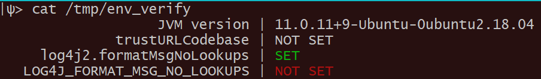
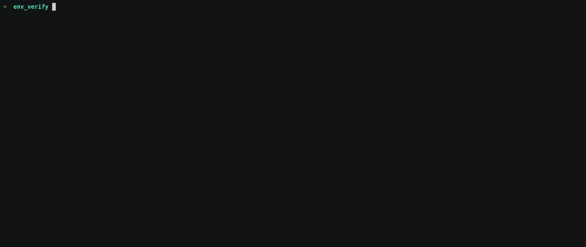

# env_verify

## About this plugin
This plugin verifies if the Java environment and command line options of your log4j-enabled Java application, allow for the exploitation of CVE-2021-44228

Run this plugin in an environment that is identical to the product application environment. 

For example, if the original production application is invoked from a bash script like so:

```shell
eval "\"${JAVA_CMD}\" ${VMARG_LIST} application ${CLASSNAME} ${ARGS[@]}" &>/dev/null &
```

Add the following line to the script, which will invoke the plugin with the same command-line arguments as the original production application:

```shell
jf env_verify run ${VMARG_LIST} > /tmp/env_verify
```

The following result is displayed after the bash script completes:




## Usage example




## Prerequisites

The `java` executable must be present on the execution PATH

This can be verified, for example, as follows:

```
$ java -version
java version "11.0.5" 2019-10-15 LTS
```


## Installation with JFrog CLI

Installing the latest version:

`$ jf plugin install env_verify`

Installing a specific version:

`$ jf plugin install env_verify@version`

Uninstalling a plugin:

`$ jf plugin uninstall env_verify`

## Usage
### Commands
`jf env_verify run [VM_ARGS]`

* run

  - Arguments:
      - VM_ARGS - Arguments to the JVM, as passed to the original Java program. "-D" flag prefix should be omitted.
  - Example:
  ```
  $ jf env_verify run log4j2.formatMsgNoLookups=True
  ```


## Additional info
None.

## Release Notes
The release notes are available [here](RELEASE.md).
