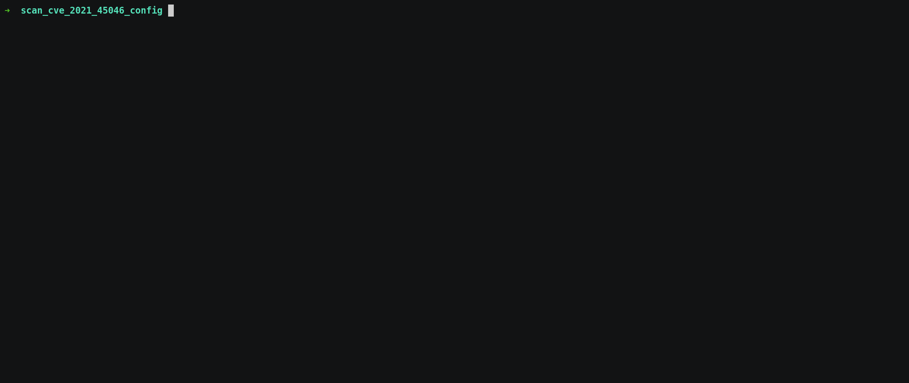

# scan-cve-2021-45046-config

## About this plugin
This plugin will scan the `root-folder` and all the archive files in it, looking for probable log4j configuration files (`xml`, `yml`, `properties`,`json`), in each looking for [configuration options](https://jfrog.com/blog/log4shell-0-day-vulnerability-all-you-need-to-know/#appendix-c) which may enable an attacker to exploit CVE-2021-45046.

Please note that an "applicable" result only means that the configuration **may** be problematic and should be inspected.

A "non-applicable" result is more conclusive, and means the configuration does not contain even the basic (publicly known) options for the exploitation of CVE-2021-45046.


## Usage example




## Prerequisites

The `java` executable must be present on the execution PATH

This can be verified, for example, as follows:

```
$ java -version
java version "11.0.5" 2019-10-15 LTS
```


## Installation with JFrog CLI
Installing the latest version:

`$ jf plugin install scan-cve-2021-45046-config`

Installing a specific version:

`$ jf plugin install scan-cve-2021-45046-config@version`

Uninstalling a plugin:

`$ jf plugin uninstall scan-cve-2021-45046-config`

## Usage
### Commands
`jf scan-cve-2021-45046-config run root-folder`

* run

  - Arguments:
      - root-folder - Directory to start the recursive scan from
  - Example:
  ```
  $ jf scan-cve-2021-45046-config run configs_dir
  ```


## Additional info
None.

## Release Notes
The release notes are available [here](RELEASE.md).
