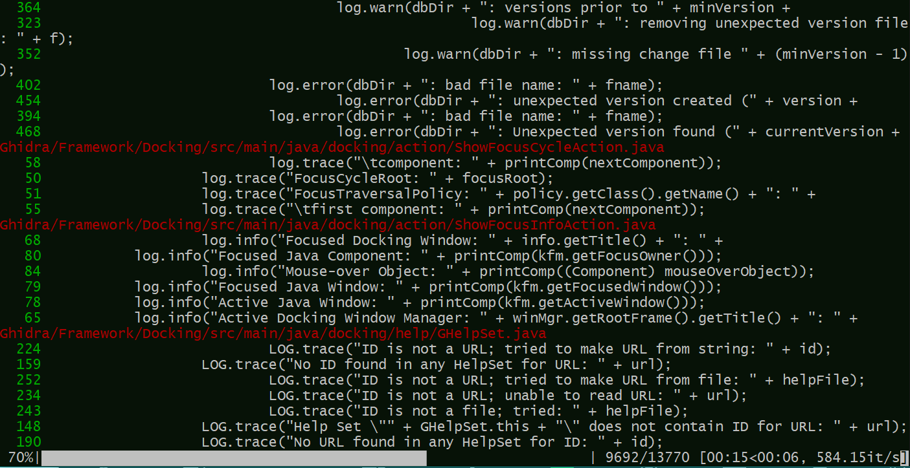

# scan_log4j_calls_src

## About this plugin
This plugin will recursively scan all `.java` files in `root-folder`, for each printing out the locations (file name and corresponding code lines) of calls to `log4j2` logging methods. 

The plugin can be configured for arbitrary classes and methods using command line flags.

Typical output looks like this:




## Usage example


## Installation with JFrog CLI

Installing the latest version:

`$ jf plugin install scan_log4j_calls_src`

Installing a specific version:

`$ jf plugin install scan_log4j_calls_src@version`

Uninstalling a plugin:

`$ jf plugin uninstall scan_log4j_calls_src`

## Usage
### Commands
`jf scan_log4j_calls_src run root-folder [--class_regex regex] [--method_regex regex] `

* run

  - Arguments:
      - root-folder - Directory to start the recursive scan from
  - Flags:
      - class_regex - Regular expression for required class name **[Default: `org/apache/logging/log4j/Logger`]**
      - method_regex - Regular expression for required method name **[Default: `(info|warn|error|log|debug|trace|fatal|catching|throwing|traceEntry|printf|logMessage)`]**
  - Example:
  ```
  $ jf scan_log4j_calls_src run srcs_dir --method_regex "(info|warn)"
  ```


## Additional info
None.

## Release Notes
The release notes are available [here](RELEASE.md).
