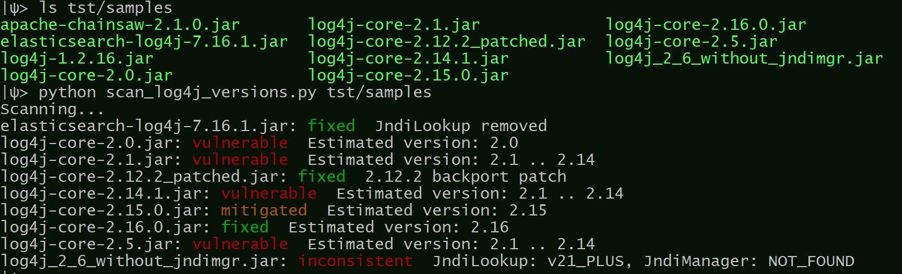
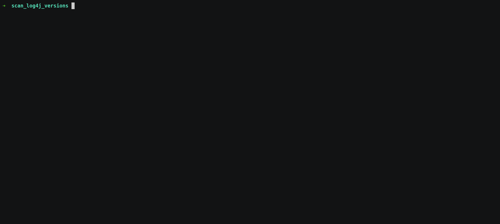

# scan-log4j-versions

## About this plugin
This plugin recursively scans the `root_folder` for `.jar` and `.war` files; For every file that is detected, the plugin looks for a `*log4j/core/net/JndiManager.class` and  `*log4j/core/lookup/JndiLookup.class` (recursively in each `.jar` file). If at least one of the classes is found, the tool attempts to fingerprint its version (including some variations found in patches and backport patches) in order to report whether the code is vulnerable.

Folders appearing after `-exclude` (optional) are skipped.



To reiterate, the results depend on the code of the classes rather than file names and the metadata. Files where both `JndiManager` and `JndiLookup` classes are not present (and hence are not vulnerable to CVE-2021-44228), like `log4j-1.x.xx.jar`, or `log4j-api-2.xx.x.jar`, do not appear in the results. Otherwise, vulnerability status and estimated version/patch status are displayed. When the versions of the two classes follow a pattern not accounted for, `inconsistent` is reported; this result should be investigated further.

#### Currently recognized log4j versions:

| Vulnerable           | Mitigated | Fixed                                                        |
| -------------------- | --------- | ------------------------------------------------------------ |
| `2.0`, `2.1 .. 2.14` | `2.15`    | `2.12.2`, `2.16`, `2.17` ,`JndiLookup removed`; patched versions `2.17.1`, `2.3.2`, `2.12.4` classified as `2.17` |

Supported archive extensions: jar, war, ear, sar, par, zip.


## Usage example




## Prerequisites

The `java` executable must be present on the execution PATH

This can be verified, for example, as follows:

```
$ java -version
java version "11.0.5" 2019-10-15 LTS
```


## Installation with JFrog CLI
Installing the latest version:

`$ jf plugin install scan-log4j-versions`

Installing a specific version:

`$ jf plugin install scan-log4j-versions@version`

Uninstalling a plugin:

`$ jf plugin uninstall scan-log4j-versions`

## Usage
### Commands
`jf scan-log4j-versions run root-folder [--exclude folder1 folder2 ...]`

* run

  - Arguments:
      - root-folder - Directory to start the recursive scan from
  - Flags:
      - exclude: don't scan the specified directories
  - Example:
  ```
  $ jf scan-log4j-versions run bins_dir --exclude bins_dir/known_safe_bins_dir
  ```


## Additional info
None.

## Release Notes
The release notes are available [here](RELEASE.md).
